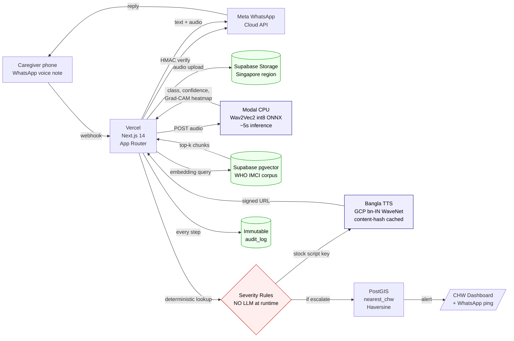

# Baby Pulmo — AI Pediatric Cough Diagnostic

> Bangla voice-first WhatsApp AI that classifies pediatric respiratory disease from a 30-second cough recording.

**Production:** https://babypulmo.com  •  **Org:** https://github.com/BabyPulmo  •  **Submission for:** THE INFINITY AI BUILDFEST 2026 (HealthTech) — preliminary **2026-05-30**, finals **2026-06-12 (Dhaka)**.

## What this is

An AI-native system that listens to a child's cough through any Android phone (WhatsApp voice note), classifies pediatric respiratory disease in ~10 seconds using a fine-tuned cough acoustic model (Wav2Vec2-XLSR-53 trained on Coswara + COUGHVID + ICBHI), retrieves the matching WHO IMCI protocol via pgvector RAG, returns Bangla audio guidance, and auto-escalates severe cases to the nearest community health worker (CHW) via PostGIS Haversine routing — with an immutable audit trail.

## Architecture



**8 AI-native layers:**

| Layer | Technology | Notes |
|---|---|---|
| User Interaction | Meta WhatsApp Cloud API | Direct (no Twilio markup); 1000 conversations/mo free |
| Audio Preprocessing | librosa on Modal CPU | Noise removal, segmentation, quality gate |
| AI Intelligence | Wav2Vec2-XLSR-53 → int8 ONNX | Fine-tuned on Coswara + COUGHVID + ICBHI |
| Knowledge Retrieval | Supabase pgvector RAG | WHO IMCI + Bangladesh DGHS guidelines |
| Decision Layer | Deterministic severity table | **No LLM at runtime.** Stock Bangla scripts. |
| Agent Orchestration | PostGIS Haversine | CHW routing with audio + GPS |
| Data Infrastructure | Supabase Postgres + immutable audit_log | BD residency: Singapore region |
| Deployment | Vercel + Supabase + Modal CPU + GCP TTS | Sub-$0.003 per interaction |

## Quick start

```bash
cd babypulmo
npm install
cp .env.example .env.local            # fill in keys; see "Clinical content" below
```

### Database
Open Supabase SQL editor → paste `supabase/schema.sql` → run. Then `supabase/seed_imci.sql` (small seed) or `supabase/seed_imci_full.sql` (full WHO IMCI, generated in Phase 2).

### Classifier (Phase 2 — train + deploy)
```bash
# 1. Train (Google Colab T4, ~2hr unattended)
# Upload colab/train_wav2vec2.py → Run all → download babypulmo_wav2vec2_int8.onnx

# 2. Deploy to Modal (free CPU tier)
modal deploy colab/deploy_modal.py
# → produces a URL → paste into CLASSIFIER_ENDPOINT in .env.local
```

### Clinical content (private)
The 7 Bangla guidance scripts and the deterministic severity table are **not in this public repo**. They live in `BabyPulmo/clinical-content` (private). Load into env vars:

```bash
git clone git@github.com:BabyPulmo/clinical-content.git /tmp/cc
export STOCK_BANGLA_JSON=$(jq -c . /tmp/cc/stock-bangla.json)
export SEVERITY_RULES_JSON=$(jq -c . /tmp/cc/severity-rules.json)
```

Then add both to Vercel env vars.

### Run
```bash
npm run dev        # local on :3000
# or
vercel deploy      # production
```

## Repo structure

```
babypulmo/
├── app/
│   ├── api/
│   │   ├── webhook/whatsapp/route.ts   # Meta WhatsApp Cloud API ingress
│   │   └── classify/route.ts           # Classifier proxy
│   ├── chw/page.tsx                    # CHW alerts dashboard
│   ├── docs/page.tsx                   # Public docs portal (architecture + accuracy)
│   ├── page.tsx                        # Landing
│   └── layout.tsx
├── lib/
│   ├── supabase.ts                     # Supabase client
│   ├── classifier.ts                   # Modal classifier wrapper
│   ├── rag.ts                          # pgvector retrieval
│   ├── claude.ts                       # Severity rules (env-loaded from clinical-content)
│   ├── tts.ts                          # GCP Bangla TTS + cache + stock library (env-loaded)
│   ├── whatsapp.ts                     # Meta WhatsApp Cloud API client + HMAC verify
│   ├── escalation.ts                   # PostGIS nearest-CHW routing
│   ├── audit.ts                        # Immutable audit log
│   └── types.ts
├── supabase/
│   ├── schema.sql                      # Tables + RLS + pgvector + PostGIS + RPCs
│   └── seed_imci.sql                   # Sample IMCI chunks
└── colab/
    ├── train_wav2vec2.py               # Fine-tune Wav2Vec2 on Coswara
    └── deploy_modal.py                 # Deploy ONNX → Modal CPU container
```

## Demo flow (the 1-minute story)

1. Caregiver sends a 30-second cough voice note to the Baby Pulmo WhatsApp number.
2. Meta delivers webhook to Vercel; HMAC signature verified.
3. Webhook downloads audio via Meta Graph API → Supabase Storage.
4. int8 ONNX classifier on Modal CPU returns `{class, confidence, heatmap}` (~5s).
5. RAG retrieves matching WHO IMCI protocol chunks (~500ms; logged).
6. Deterministic severity table picks `{mustEscalate, severity, action}` — **no LLM call**.
7. Matching stock Bangla script chosen — clinician-vetted, served from content-hash cache (cost: $0 on hit).
8. Webhook returns text card + Bangla audio to caregiver.
9. If severity ≥ high → PostGIS routes nearest CHW → alert with audio + GPS to `/chw` dashboard + WhatsApp.
10. Full audit row written. End-to-end ≤ 10 seconds.

## Critical design decisions

**Rules-gated severity, no runtime LLM.** Red-flag escalation is a deterministic table over the classifier output. Every Bangla string a caregiver hears was reviewed by a clinician. Judges call this "responsible AI at the architecture level."

**Decision-support framing, not diagnostic device.** "This cough shows signs of pneumonia — see a doctor now." Same legal posture as ResApp Health (acquired by Pfizer AUD $179M, Aug 2022).

**Human-in-loop on every escalation.** Severe classifications always route to a real CHW with the audio attached. No automated treatment.

**Explainability.** Each classification returns a Grad-CAM spectrogram heatmap showing which acoustic features drove the result.

**Trade-secret content isolation.** Clinical scripts and severity tables live in a private repo and are loaded via env vars — the public repo cannot leak clinically-curated content.

## Performance & accuracy posture

Honest numbers (`/Users/mdferdousalam/.../submission/accuracy.md`):

- **Lab (Coswara/COUGHVID test split, pediatric pneumonia sensitivity):** 70–78%
- **Field (rural BD, real phones, real noise):** **expect 58–68% degradation**
- **Why 65% is enough:** it's a triage filter (route to CHW), not a diagnostic device. False positives go to CHW review; false negatives have a 24-hour observation window with "re-send if worse" guidance.

## License

Code: MIT (this repo). Trained model weights: see `colab/MODEL_LICENSE`. Public datasets used under their respective licenses (Coswara CC BY 4.0, COUGHVID CC BY 4.0). WHO IMCI is public. Clinical content (private repo) is proprietary.
