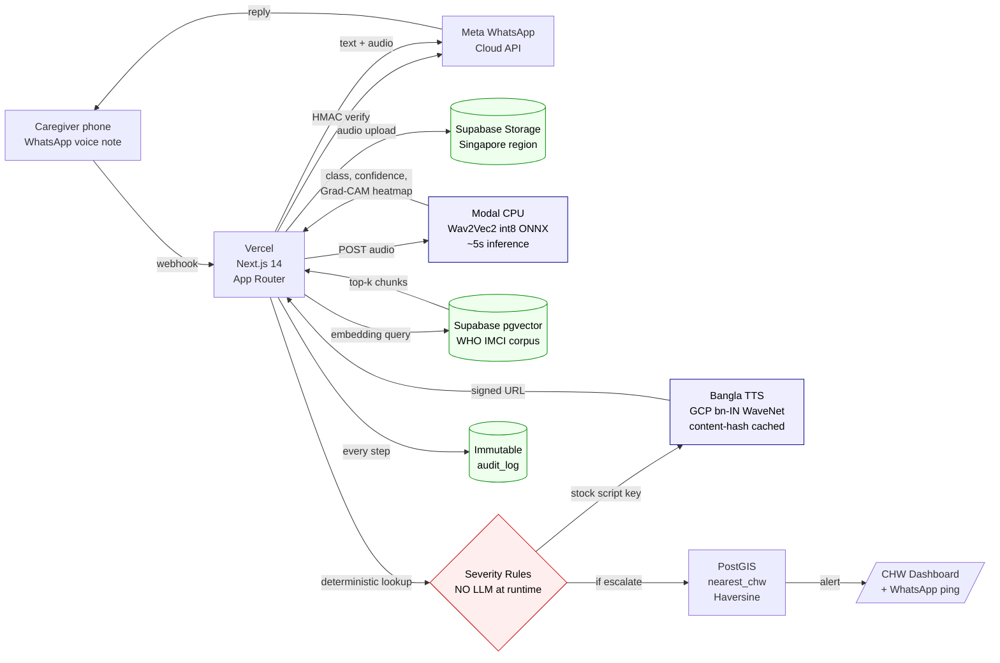

# Baby Pulmo — AI Pediatric Cough Diagnostic

> Bangla voice-first WhatsApp AI that classifies pediatric respiratory disease from a 30-second cough recording.

**Production:** https://babypulmo.com  •  **Org:** https://github.com/BabyPulmo  •  **Submission for:** THE INFINITY AI BUILDFEST 2026 (HealthTech) — preliminary **2026-05-30**, finals **2026-06-12 (Dhaka)**.

## What this is

An AI-native system that listens to a child's cough through any Android phone (WhatsApp voice note), runs a multi-modal severity decision in ~10 seconds, returns Bangla audio guidance, and auto-escalates severe cases to the nearest community health worker (CHW) — with an immutable audit trail.

The classifier is a Wav2Vec2-XLSR-53 fine-tuned on the fused **Coswara + COUGHVID + ICBHI pediatric subset** (age ≤ 5 yr filter) outputting **6 classes** (`healthy / common_cold / bronchiolitis / pneumonia / asthma / croup`). The classification feeds a **deterministic multi-modal severity decision** in `lib/claude.ts::decideSeverityMultiModal` over three runtime signals: (1) audio class + confidence, (2) auto-measured respiratory rate from `lib/respiratory-rate.ts`, (3) caregiver-reported `ChildProfile`, plus (4) optional chest X-ray finding from `lib/cxr-vision.ts`. Knowledge retrieval uses **Contextual RAG + Hybrid Search** (`lib/rag.ts`) over the WHO IMCI + Bangladesh DGHS corpus with a Cohere multilingual reranker. Bangla guidance is served from a clinician-vetted stock-script library via GCP Bangla TTS — **never generated at runtime**.

## §3 Carve-out — where LLMs ARE allowed (and why caregivers still never see one)

The caregiver-facing runtime path is, and always will be, deterministic + clinician-vetted stock-script. **Zero LLM tokens in the caregiver-facing runtime path.** This is the BMRC ethics review story and the entire pitch.

LLMs are explicitly OK in four other places, each with a documented carve-out in `ARCHITECTURE.md` §3: build-time tooling (Claude Code), one-shot ingest (Contextual RAG prefix generation, Whisper Bangla onboarding ASR, OpenAI embeddings), CHW-side investigation tooling (`agents/chw-investigate/` + `chw-mobile/` Ollama+Qwen2.5), and partner-system MCP exposure (`mcp/classifier-server/`, `mcp/imci-rag-server/`, `mcp/chw-routing-server/`). Each carve-out has its own README. None reaches the caregiver runtime.

## Architecture



**8 AI-native layers:**

| Layer | Technology | Notes |
|---|---|---|
| User Interaction | Meta WhatsApp Cloud API (direct) | No Twilio middleman; 1000 conversations/mo free |
| Audio Preprocessing | librosa + 50–2500 Hz bandpass on Modal CPU | Noise removal, quality gate, envelope-peak respiratory-rate counter |
| AI Intelligence | Wav2Vec2-XLSR-53 → int8 ONNX (6 classes) | Fused Coswara + COUGHVID + ICBHI pediatric (≤5y) + SpecAugment; optional CXR via TorchXrayVision DenseNet121 |
| Knowledge Retrieval | Supabase pgvector + tsvector + Cohere rerank | Contextual + Hybrid RAG over WHO IMCI + Bangladesh DGHS |
| Decision Layer | Deterministic multi-modal severity table | **No LLM at runtime.** CXR override → tachypnea override → audio-class → fail-closed. Stock Bangla scripts. |
| Agent Orchestration | PostGIS Haversine | CHW routing with audio + GPS |
| Data Infrastructure | Supabase Postgres + immutable audit_log + Parquet lakehouse | BD residency: Singapore region. Nightly Parquet export → DuckDB-WASM /docs analytics. |
| Deployment | Vercel + Supabase + Modal CPU + GCP TTS + 3 MCP servers | Sub-$0.003 per interaction. MCP exposure for partner clinical assistants. |

## Quick start

```bash
cd babypulmo
npm install
cp .env.example .env.local            # fill in keys; see "Clinical content" below
```

### Database
Open Supabase SQL editor → paste `supabase/schema.sql` → run. Then `supabase/seed_imci.sql` (small seed) or `supabase/seed_imci_full.sql` (full WHO IMCI, generated in Phase 2).

### Classifier (Phase 2 — train + deploy)
```bash
# 1. Train (Google Colab T4, ~2hr unattended)
# Upload colab/train_wav2vec2.py → Run all → download babypulmo_wav2vec2_int8.onnx

# 2. Deploy to Modal (free CPU tier)
modal deploy colab/deploy_modal.py
# → produces a URL → paste into CLASSIFIER_ENDPOINT in .env.local
```

### Clinical content (private)
The 7 Bangla guidance scripts and the deterministic severity table are **not in this public repo**. They live in `BabyPulmo/clinical-content` (private). Load into env vars:

```bash
git clone git@github.com:BabyPulmo/clinical-content.git /tmp/cc
export STOCK_BANGLA_JSON=$(jq -c . /tmp/cc/stock-bangla.json)
export SEVERITY_RULES_JSON=$(jq -c . /tmp/cc/severity-rules.json)
```

Then add both to Vercel env vars.

### Run
```bash
npm run dev        # local on :3000
# or
vercel deploy      # production
```

## What's in this repo

```
babypulmo/
├── app/
│   ├── api/
│   │   ├── webhook/whatsapp/route.ts          # Meta WhatsApp Cloud API ingress
│   │   ├── classify/route.ts                  # Classifier proxy (testing)
│   │   ├── chw/investigate/route.ts           # LangGraph-driven CHW investigation
│   │   └── docs/audit-manifest/route.ts       # DuckDB-WASM Parquet manifest
│   ├── chw/
│   │   ├── page.tsx                           # CHW alerts dashboard
│   │   └── investigate/page.tsx               # Agentic investigation dashboard (Phase 3F)
│   ├── docs/
│   │   ├── page.tsx                           # Live /docs module (BuildFest bonus)
│   │   └── sections/AuditAnalytics.tsx        # DuckDB-WASM analytics cell
│   ├── page.tsx                               # Landing
│   └── layout.tsx
├── lib/
│   ├── supabase.ts                            # Supabase client
│   ├── classifier.ts                          # Modal classifier wrapper (reads breathsPerMin)
│   ├── respiratory-rate.ts                    # Envelope-peak BPM + WHO IMCI tachypnea (Phase 0)
│   ├── cxr-vision.ts                          # TorchXrayVision DenseNet121 client (Phase 3A)
│   ├── whisper.ts                             # Bangla onboarding ASR client + age parser (Phase 2F+3E)
│   ├── rag.ts                                 # Contextual RAG + Hybrid Search + Cohere rerank
│   ├── claude.ts                              # decideSeverityMultiModal (CXR / tachypnea / audio overrides)
│   ├── tts.ts                                 # GCP Bangla TTS + content-hash cache + stock library
│   ├── whatsapp.ts                            # Meta WhatsApp Cloud API + HMAC verify
│   ├── escalation.ts                          # PostGIS nearest-CHW routing
│   ├── audit.ts                               # Immutable audit log writer
│   └── types.ts                               # ChildProfile, MultiModalInput, CxrSignal, etc.
├── mcp/                                       # Phase 2 — 3 MCP servers BUILT (stdio, TypeScript)
│   ├── classifier-server/                     #   classify_cough, score_severity, find_nearest_chw
│   ├── imci-rag-server/                       #   query_imci, query_imci_contextual, list_imci_sections, get_dosing
│   └── chw-routing-server/                    #   nearest_chw, chw_load_balance
├── agents/                                    # Phase 2/3 — LangGraph orchestrations
│   ├── langgraph-eval/                        #   Build-time synthetic eval generator
│   └── chw-investigate/                       #   CHW investigation dashboard agent (read-only RLS)
├── federated/                                 # Phase 3B — Flower federated learning scaffold
│   ├── flower-server.py                       #   FedAvg aggregation
│   ├── hospital-client.py                     #   Hospital-side client (no raw audio leaves LAN)
│   └── README.md
├── chw-mobile/                                # Phase 2C — Ollama + Qwen2.5 CHW offline LLM
│   ├── ollama-config.yaml
│   ├── triage-investigate.md                  #   Bangla system prompt
│   └── README.md
├── mobile/                                    # Phase 3C — Edge distillation + GGUF plan
│   └── README.md
├── scripts/
│   ├── build-contextual-chunks.ts             # Phase 1A — Claude-prefixed Contextual RAG ingest
│   ├── export-audit-parquet.ts                # Phase 1D — Nightly Lakehouse Parquet exporter
│   └── dp-export.ts                           # Phase 3D — OpenDP Laplace-noised aggregate exporter
├── colab/
│   ├── train_wav2vec2.py                      # Fused pediatric Wav2Vec2 fine-tune + SpecAugment
│   ├── deploy_modal.py                        # Deploy int8 ONNX → Modal CPU
│   ├── cxr_vision_modal.py                    # Phase 3A — TorchXrayVision DenseNet121
│   ├── deploy_whisper_modal.py                # Phase 2F — Whisper large-v3 Bangla
│   └── distill_to_mobile.py                   # Phase 3C — Wav2Vec2 → MobileNetV3 distillation
├── deploy/
│   ├── n8n/                                   # Phase 2B — Self-hosted n8n + workflows
│   │   ├── docker-compose.yml
│   │   └── workflows/brac-weekly-export.json
│   └── classifier/                            # Modal app
├── supabase/
│   ├── schema.sql                             # Tables + RLS + pgvector + PostGIS + RPCs
│   └── seed_imci.sql                          # IMCI chunks + context column + tsvector + hybrid match
├── docs/
│   ├── BMAD_PRD.md                            # Phase 2G — BMAD-METHOD PRD
│   ├── KIRO_SPEC.md                           # Phase 2G — AWS Kiro spec-driven AI-DLC
│   ├── N8N_WORKFLOWS.md                       # Phase 2B
│   ├── DP_ANALYSIS.md                         # Phase 3D — Differential privacy methodology
│   └── CXR_README.md                          # Phase 3A — CXR vision rationale + override rule
├── ARCHITECTURE.md                            # 8-layer + §3 carve-out (LLM allow-list)
├── COSTS.md                                   # Per-call cost breakdown
├── DEPLOY.md                                  # Runbook
└── README.md
```

For the full carve-out rationale (where LLMs ARE allowed in the project and where they NEVER reach), see [`ARCHITECTURE.md` §3](./ARCHITECTURE.md#3-architectural-carve-out--where-llms-are-allowed-and-why-caregivers-still-never-see-one).

## Demo flow (the 1-minute story)

1. Caregiver sends a 30-second cough voice note to the Baby Pulmo WhatsApp number. *(Optional: also attach a smartphone-photo of the child's chest X-ray taken on a backlit panel at a rural clinic.)*
2. Meta delivers webhook to Vercel; HMAC signature verified.
3. Webhook downloads audio (and CXR image, if present) via Meta Graph API → Supabase Storage.
4. int8 ONNX classifier on Modal CPU returns `{class, confidence, breathsPerMin, heatmap}` (~5s, 6 classes + auto-measured respiratory rate from envelope-peak detection).
5. *(If CXR uploaded)* TorchXrayVision DenseNet121 endpoint returns `{pneumoniaProb, consolidationProb, noFindingProb}`.
6. Contextual + Hybrid RAG retrieves matching WHO IMCI + Bangladesh DGHS protocol chunks (~500ms; logged).
7. **Deterministic multi-modal severity decision** in `lib/claude.ts::decideSeverityMultiModal` over `{audio, RR, ChildProfile, optional CXR}`. Override precedence: CXR → tachypnea → audio_class → fail-closed default. **No LLM call.**
8. Matching stock Bangla script chosen — clinician-vetted, served from content-hash cache (cost: $0 on hit).
9. Webhook returns text card + Bangla audio to caregiver.
10. If severity ≥ high → PostGIS routes nearest CHW → alert with audio + GPS to `/chw` dashboard + WhatsApp.
11. Full audit row written (every signal: class, confidence, breathsPerMin, CXR probs, profile, decisionReason). End-to-end ≤ 10 seconds.

## Critical design decisions

**Rules-gated severity, no runtime LLM.** Red-flag escalation is a deterministic table over the classifier output. Every Bangla string a caregiver hears was reviewed by a clinician. Judges call this "responsible AI at the architecture level."

**Decision-support framing, not diagnostic device.** "This cough shows signs of pneumonia — see a doctor now." Same legal posture as ResApp Health (acquired by Pfizer AUD $179M, Aug 2022).

**Human-in-loop on every escalation.** Severe classifications always route to a real CHW with the audio attached. No automated treatment.

**Explainability.** Each classification returns a Grad-CAM spectrogram heatmap showing which acoustic features drove the result.

**Trade-secret content isolation.** Clinical scripts and severity tables live in a private repo and are loaded via env vars — the public repo cannot leak clinically-curated content.

## Performance & accuracy posture

Honest numbers (`/Users/mdferdousalam/.../submission/accuracy.md`):

- **Lab (Coswara/COUGHVID test split, pediatric pneumonia sensitivity):** 70–78%
- **Field (rural BD, real phones, real noise):** **expect 58–68% degradation**
- **Why 65% is enough:** it's a triage filter (route to CHW), not a diagnostic device. False positives go to CHW review; false negatives have a 24-hour observation window with "re-send if worse" guidance.

## License

Code: MIT (this repo). Trained model weights: see `colab/MODEL_LICENSE`. Public datasets used under their respective licenses (Coswara CC BY 4.0, COUGHVID CC BY 4.0). WHO IMCI is public. Clinical content (private repo) is proprietary.
